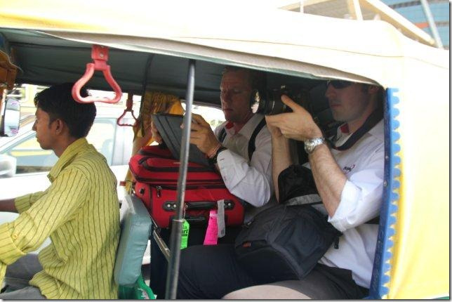
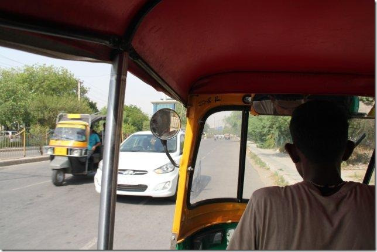
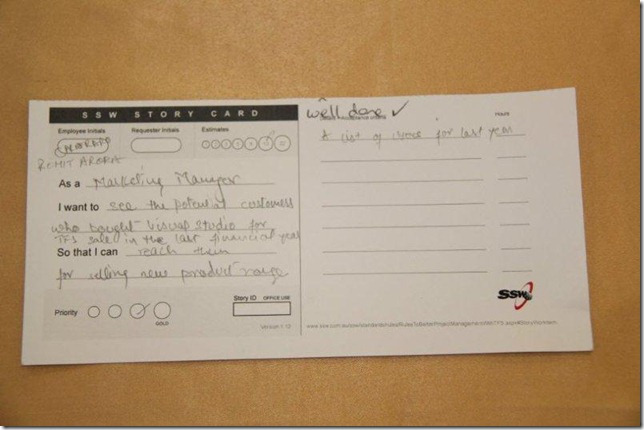
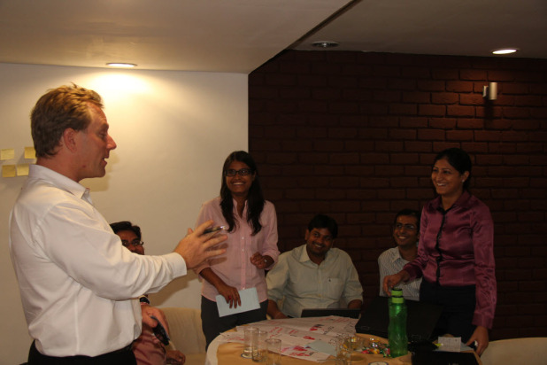
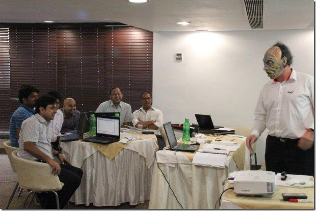
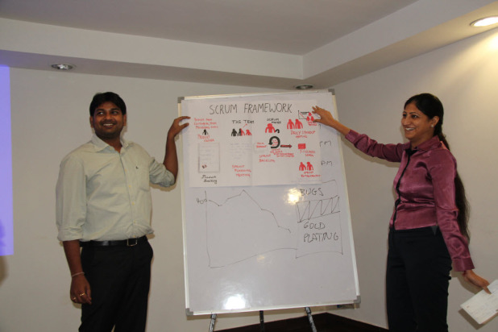

I’m in India at the moment with <a href="http://www.adamcogan.com">Adam Cogan</a> and <a title="Damian Brady" href="http://damianbrady.com.au" target="_blank" rel="noopener">Damian Brady</a>  helping out on a Professional Scrum Developer course. The training is with a group of 24 guys with varying roles - developers, testers, architects, and managers. At the end of the course, they will all have the opportunity to sit an online exam to become “Professional Scrum Developers”.

It was such a fun day, we decided to sit down and write a blog post together.
<h3>Pre-day one</h3>
We decided to catch a couple of tuk-tuks to the venue.  Adam C somehow managed to send emails on his iPad while cramped in the back.

[caption id="" align="alignnone" width="644"] Setting off on our way…. little did we know that the driver had no idea where he was going[/caption]

One of the important things you learn about in Scrum is an Impediment.  Even before day 1 started, we had our first one.

<strong>Impediment 1: </strong>The distance from our hotel to the training venue was about 2km.  The 1.5 hour journey (yes, one and a half hours) to this venue on the first day included three lost taxis (two independently finding their way to the same wrong address) and several near-death experiences.
Tip: Don’t think about complaining to your tuk-tuk driver or else you will find him try to make you happy by driving the wrong way down a busy main road.

[caption id="" align="alignnone" width="644"] Our tuk-tuk driver saving time – you have no idea how we felt.[/caption]
<h3>Getting Started with “Scrumdementals”</h3>
<strong>Impediment 2:</strong> Day 1 officially started with Adam noticing that only one of the 24 students had read the Scrum guide. To bring everyone up to speed, he was able to give a succinct rundown of the Scrum user guide with the help of a few SSW rules (<a href="http://rules.ssw.com.au/Management/RulesToBetterScrumUsingTFS/Pages/DoYouKnowThatWorkingInATeamIsBetterThanOnYourOwn.aspx">The importance of a team</a>, <a href="http://rules.ssw.com.au/Management/RulesToBetterScrumUsingTFS/Pages/Scrumguide.aspx">Reading the Scrum Guide</a>, and <a href="http://rules.ssw.com.au/Management/RulesToBetterScrumUsingTFS/Pages/PhysicalTaskboard.aspx">Physical Task Boards</a>) and the awesome <a href="http://www.youtube.com/watch?v=Q5k7a9YEoUI">“Scrum Master in Under 10 Minutes”</a> video by Hameed Shojaee.

The “guts” of Scrum was covered, with particular reference to short iterations, multi-skilled teams and timeboxing.  Adam C also told a story about his years in the army, and pressed  the point about the “inspect and adapt” tenet of Scrum which got a laugh.  The army tends to plan a mission, watch it all go very differently, and then debrief so they can adapt.

Adam C talked about the burndown and asked which time fields in a User Story mattered for the burndown.  Two of the 24 students already knew that the only time field that Scrum cares about is the “remaining time”.  Adam went on to explain why this was, and why the “original estimate” and “actual time” spent fields aren’t as important.
<h3>User Stories</h3>
After a morning break, Adam C spoke to the group about User Stories. Everybody loved his quintessential example with accompanying story:
<blockquote>As a marketing manager
I want to search for customers
So that I can call them up</blockquote>
He followed this up with a discussion about Acceptance Criteria and why they were so important.  Referencing the <a href="http://rules.ssw.com.au/Management/RulesToBetterScrumUsingTFS/Pages/Do-Your-User-Stories-Include-Acceptance-Criteria.aspx">SSW rule on Acceptance Criteria</a>, (one of my favourites - I wrote it) it was pointed out that you should never assume “gold plating” for a User Story.  The group appreciated the clarification on acceptance criteria and agreed that it was important for clarity.

Adam C’s next instruction was for each student to write one of their current working items in the form of a <a href="http://www.ssw.com.au/ssw/Standards/Rules/RulesToBetterProjectManagementWithTFS.aspx#PrintedStoryCard">SSW story card</a>.  Some were good, and some were not so good.  Damian reviewed his favourite ones to the class.

[caption id="" align="alignnone" width="644"] Rohit Arora’s great Story Card[/caption]

Sprint One

After lunch, the group was asked to self-organise into four teams of six.  Initially, the groupings weren’t ideal (all the developers with MVC experience were in the same team), maybe the ‘multi-skilled’ point was forgotten… a quick bit of shuffling was required.

<strong>Bonus 1: </strong>Even though team members were being split up, the new teams worked really well together.

[caption id="attachment_57" align="alignnone" width="618"] The teams worked very well together[/caption]

Next, the Product Owner entered the room and scared everyone with his tough requirements. He is a Product Owner you don’t want to mess with.

[caption id="" align="alignnone" width="644"] The Product Owner giving his requirements[/caption]

He spent 10 minutes (timeboxed) giving out requirements for the first one hour sprint. The task was to create a poster for his boardroom.  The sprint was split into four 15min “days”, after which the teams presented the results in the review meeting.

<strong>Impediment 3:</strong>  Every half hour or so, a “black room event” occurred. No, not a “black swan event” :-).  Apparently power outages are fairly common in Delhi, but every time it happened, the laptops switched to battery and all network connections were lost.

The post-sprint Review meetings were fun with the teams presenting some different results in their work.  The Product Owner was hard to please, but we think under that tough skin, he was generally pleased with the work.  The same can’t be said about the process.  In the end, he chose his favourite diagram to hang on his boardroom wall.

[caption id="attachment_58" align="alignnone" width="618"] The Product Owner’s favourite diagram had some excellent artwork[/caption]

The Retrospective meeting was even more fun and the teams learnt some very valuable lessons.  However, Adam C explained that every one of the the teams was naughty:
<ol>
	<li>Only 1 of 4 teams took up the invitation to speak to the Product Owner about what he wanted</li>
	<li>2 teams did a User Story for the task (despite Adam C giving several “Printed Story Cards” to each team)</li>
	<li>None of the teams kept a Backlog</li>
	<li>None of the teams did a Daily Standup, and</li>
	<li>Only 2 teams followed the brief and included pretty pictures (this was very important to the Product Owner)</li>
</ol>
Later on, Adam C presented his ideal Scrum diagram and spoke about how it clearly shows the Scrum process from start to finish.

Retrospective

The day ended with a retrospective where each student talked about what they liked and disliked about the day.

The top two highlights of the day – repeated multiple times - were:
<ol>
	<li>Writing User Stories and learning about why the wording was important</li>
	<li>Learning about effective acceptance criteria</li>
</ol>
The students said they were very happy with the course so far. They wanted 2 things improved for the next day:
<ol>
	<li>There weren’t enough videos (we’ll fix that on day 2!)</li>
	<li>Lunch was too early</li>
</ol>
Can’t wait for Day 2.