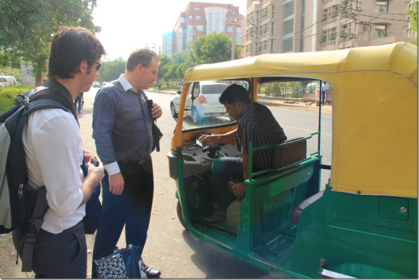
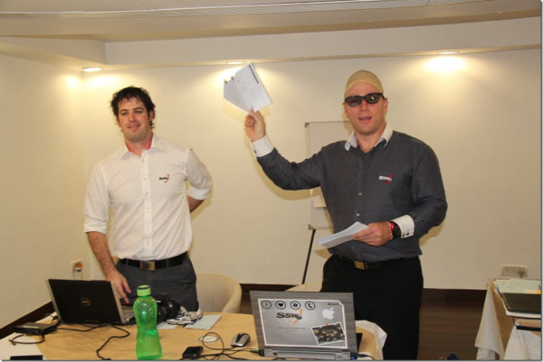

In case you missed <a href="http://adamstephensen.wordpress.com/2011/06/01/professional-scrum-developer-course-new-delhi-day-1/">yesterday’s post</a>, I’m in New Delhi at the moment with <a href="http://www.adamcogan.com">Adam Cogan</a> and <a title="Damian Brady" href="http://damianbrady.com.au" target="_blank">Damian Brady</a> helping out with a Professional Scrum Developer course.
<h3>Day 2 begins</h3>
Day 2 started a lot smoother than Day 1 because we now knew the way to the venue.

<strong>Bonus 1:</strong> Today, we made it to the training venue in only 3 minutes vs. 1.5 hours yesterday. Talk about continuous improvement!

Today’s agenda saw a lot more interaction with the lovely Team Foundation Server (TFS).  It was time to see Scrum in action with the Microsoft tools.

<strong>Impediment 1:</strong> <a href="http://sharepoint.ssw.com.au/AboutUs/Employees/Pages/Matthew.aspx">Matthew Hodgkins</a> spent some time setting up laptop for us to bring along to the course.  It was set up with domain server and a TFS Virtual Machine ready for all the students to connect to.  We were expecting a room full of cables to a switch, but unfortunately the training venue only had wireless. There was no way for students to connect!

<strong>Bonus 1:</strong> With a lot of help from Matthew and Parmod Kumar (one of the Sysadmins working with the students), we got the server reconfigured so everyone could connect!
<h3>Work Items in TFS</h3>
Adam C started the day by cracking open TFS and walking through the work item world:
<ul>
	<li>Creating a Team Project</li>
	<li>Team Collections</li>
	<li>Areas and Iterations</li>
	<li>Managing Sprint Work Items</li>
	<li>Creating some Product Backlog Items</li>
	<li>Creating and Linking a Task</li>
	<li>Creating and Linking a Test Case</li>
	<li>Creating and Linking a Bug</li>
	<li>Managing Impediments</li>
	<li>Adding Check-in Policies</li>
</ul>
Adam professed his love for Story Overview reports and also <a href="http://www.google.co.in/search?q=priyanka+chopra&um=1&ie=UTF-8&tbm=isch&source=og&sa=N&hl=en&tab=wi&biw=1280&bih=675&uss=1">Priyanka Chopra</a>.  He also spoke about his “tough” guts and what a “handbreak” Damian and I were for not eating street food with him.

He let the teams have a quick break while he introduced them an awesome tool called <a href="http://research.microsoft.com/en-us/projects/DebuggerCanvas/">Debugger Canvas</a>.

Then it was on to TFS integration with Microsoft Excel and Project 2010, TeamCompanion, and UrbanTurtle.

Adam introduced the first sprint of the day by telling everyone that there was a new Product Owner. He talked about all the things this new PO might want, so they would be well prepared when he arrived.
<h3>A new Product Owner arrives</h3>

This new Product Owner was a bit odd.  He talked about his new wife, the new Tailspin website he purchased, and the Chinese developers he had sacked.  He told them about the bugs some people had told him about, and asked them to:
<ul>
	<li>Connect to TFS</li>
	<li>Log in to the SQL database</li>
	<li>Create a Team Project</li>
	<li>Add the 2 check-in policies he had heard about at a Microsoft seminar (being the “comments one in the Powertools”, and the “work items one that comes out of the box”)</li>
	<li>Check that the code from the Chinese developers compiles</li>
	<li>Tell him where he stands, and whether those Chinese guys were truthful when they told him it was “99% done”</li>
</ul>

The students had been given so much new information that morning, we were interested to know what they actually “heard”.
<h3>Review</h3>
All of the teams did OK considering this was their very first technical presentation.  We all know the human brain starts working when you’re born, and doesn't stop until you stand up to speak in public.

Interestingly, they were very keen to show the Product Owner *all* of the work items they had created.  They had a very different idea of what they had to do.

There were a few impediments this time, however.  The teams found that they needed to install TFS Powertools in order to add the Check-in Policies.  Due to frequent power outages (apparently rampant in summer), this seemed to cause a lot of problems.  “Team Masters" had even added an impediment to TFS saying that TFS was down and was blocking them!  The Product Owner looked at them very incredulously.

“Team Scrumsters” actually fired up the new application and showed it working.  They were the only team that got the Product Owner jumping up and down with excitement.

Before the Product Owner left, he played a video to introduce the students to some of his “American culture”. He played <a href="http://www.youtube.com/watch?v=pipTwjwrQYQ">a Charlie Sheen video</a> and talked about the importance of “winning”.
<h3>Retrospective</h3>
The big lesson that came out of the acceptance criteria was that the teams didn’t clearly understand what the Product Owner wanted.  Every team had a very different idea of what was required:
<h3>Lunch</h3>
Once again, lunch was delicious.  I asked heaps of questions about the selection of traditional Indian foods, the answers being fascinating.  I'm well and truly on track to come home with some new recipes!

After lunch, Adam C treated the group to some Australian culture in the form of an <a href="http://www.youtube.com/watch?v=qp-EAG29Qnc">ad for Fosters</a>.  He followed this up with a (remarkably similar) <a href="http://www.youtube.com/watch?v=BRI-A3vakVg">Canadian Molson video</a> and was disappointed when the group preferred the Canadian version!
<h3>Example meetings</h3>
During lunch, Pradeep requested they see how the Aussies do their planning and standup meetings.

Adam C asked Damian and I to stand up in front of the class and start work on a new sprint.
<ul>
	<li>We started with the creation of a backlog, estimated tasks (with their fists), and created a burndown</li>
	<li>We started and finished day one, and just as we finished,</li>
	<li>Adam got us to do a day 2 standup, complete with a burndown update</li>
</ul>

<strong>Bonus 2: </strong>This<strong> </strong>ended up being quite worthwhile.  Some of the students said it was the highlight as they got to see how it was “meant” to be done.

Adam C played the students a <a href="http://www.youtube.com/watch?v=8aYl7N0JPWs">Karate Kid video</a> to highlight the point that following the Scrum process is like developing muscle memory. If you follow the process, it starts to become second nature and you reap the benefits.
<h3>Sprint 2</h3>
Sprint 2 saw the teams get deeper into the solution.  They were asked to enter some more Product Backlog Items and make sure each person raised a bug.

<strong></strong>

<strong>Bonus 3:</strong> This sprint, every one of the teams did a standup and one team implemented the “fist” estimation technique.

The Review and Retrospective meetings were are lot more impressive this time.  All teams did a great job with their presentation and the Scrum process was finally in action in all its glory.

To close off the day, Adam C played a <a href="http://www.youtube.com/watch?v=cgGL6SbMfKc">video showing how Emperor penguins work as a team for survival in Antarctica</a>.  He emphasised the importance on the team in the Scrum framework.  If everyone is prepared to give their bit for the team, it will benefit everyone.
<h3>Retrospective Day 2</h3>

There was a lot of great feedback from the students on how the day went.  Some of the many highlights the group mentioned were:
<ul>
	<li>Learning to focus on what the Product Owner wants, not the process</li>
	<li>Seeing the tool (TFS) was much different to just knowing the theory</li>
	<li>The demo of the “Aussie” planning and standup meetings</li>
	<li>The Karate Kid story – the group now knows this is something to follow day in and day out</li>
	<li>Learning what Scrum terms map to what TFS work items</li>
	<li>The Excel and TeamCompanion demos</li>
	<li>Working as a team</li>
	<li>Doing the exercises</li>
	<li>Learning about Check-in Policies</li>
	<li>Moving from theory to practical implementation</li>
	<li>The story of the Antarctic penguins and <a href="http://rules.ssw.com.au/Management/RulesToBetterScrumUsingTFS/Pages/DoYouKnowThatWorkingInATeamIsBetterThanOnYourOwn.aspx">the importance of working in a good team</a></li>
</ul>
Tomorrow will see us delve deeper into Scrum using TFS and we’ll look at using Microsoft Test Manager to help run tests and raise very rich and repeatable bugs.