<h5>The default Agile TFS template ships with three states: New, Active and Closed. </h5> 
A common question that I am asked is how to add an extra stage to the TFS taskboard. 
While this is not trivial in TFS 2012, it’s really not that hard once you know how, and is being made easier in newer versions of TFS. 
<a href="./images/clip_image0012.png">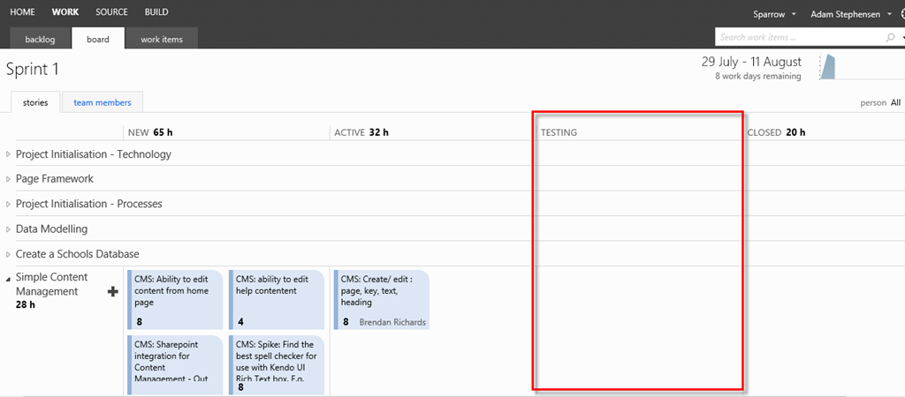</a> 
Figure: We will demonstrate adding a ‘Testing’ column. <h3>Step 1: Ensure that you are an administrator of the Team Project you are updating</h3> <h3>Step 2: Download the Team Foundation Server 2012 Power Tools</h3> 
- In Visual Studio select <b>Tools</b>, and then <b>Extensions and Updates</b> 
<a href="./images/clip_image0021.png">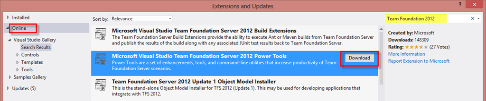</a> 
Figure: Select <b>Online</b> from the left menu, enter <b>Team Foundation 2012</b> in the search field, click the Download button on <b>Microsoft Visual Studio Team Foundation Server 2012 Power Tools</b> <h3>Step 3: Export the Task Work Item Type</h3> 
To add a new column to the task board, we need to add that status to the work item type definition. 
<a href="./images/clip_image0031.png">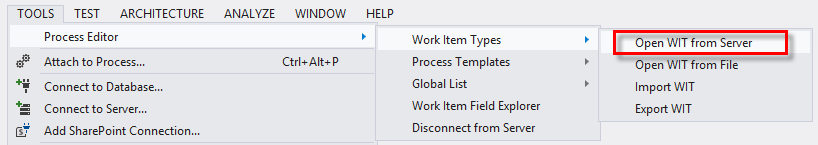</a> 
Figure: From the <b>Tools</b> menu select, <b>Process Editor</b>, then <b>Work Item Types</b> and then <b>Open WIT from Server</b> 
<b></b> 
<a href="./images/clip_image0041.png">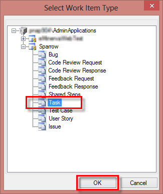</a> 
Figure: Expand the correct Team Project and select the <b>Task</b> work item type.  <h3>Step 4: Add the Testing state to the Task WIT</h3> 
<a href="./images/clip_image0051.png">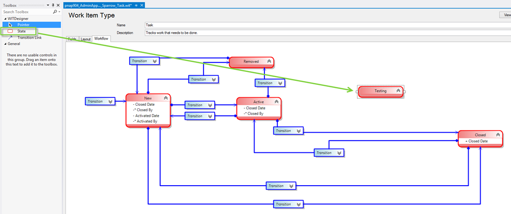</a> 
Figure: Select the <b>Workflow tab. </b>Open the toolbox and drag a <b>State</b> component onto the design surface. Right click on the new State, select Properties and set the Name property to <b>Testing</b> 
<a href="./images/clip_image0061.png">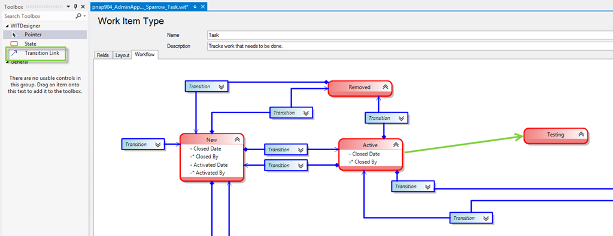</a> 
Figure: Select the <b>Transition Link</b> component from the toolbox. Now click on the Active state and drag your mouse to the Testing state.  
<a href="./images/clip_image0071.png">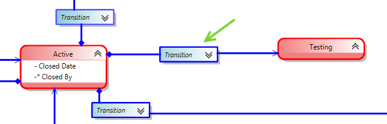</a> 
Figure: A transition will have been added from Active to Testing.  
<a href="./images/clip_image0081.png">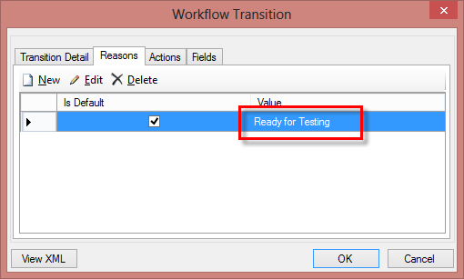</a> 
Figure: Right click on the Transition and choose <b>Open Details.</b> Go to the Reasons tab and Edit the reason value. Suggested test: ‘Ready for Testing’. You can click on the chevrons to expand the transition to be able to more clearly see the assigned properties.  
Additional actions and Fields can also be specified but that is beyond the scope of this post. 
<a href="./images/clip_image0091.png">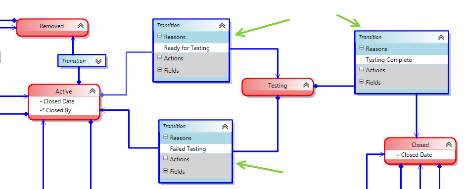</a> 
Figure: Repeat the process above to add transitions from Testing to Complete (with a reason of ‘Testing Complete’) and from Testing back to Active (with a reason of ‘Failed Testing’). 
<a href="./images/clip_image0101.png">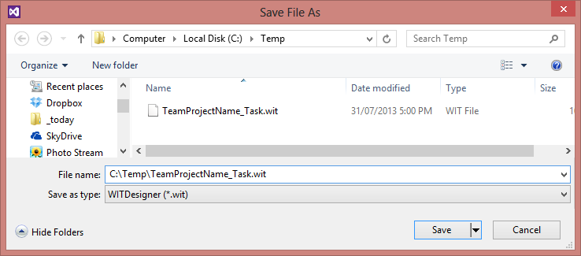</a> 
Figure: Save the template to a known location on your hard drive so that it can be imported in the next step. E.g. c:\Temp\TeamProjectName_Task.wit <h3>Step 5: Import the saved WIT</h3> 
<a href="./images/clip_image0111.png">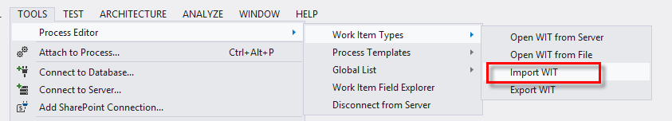</a> 
Figure: From the Tools menu select Process Editor, then Work Item Types and then <b>Import WIT</b>. 
<a href="./images/clip_image0121.png">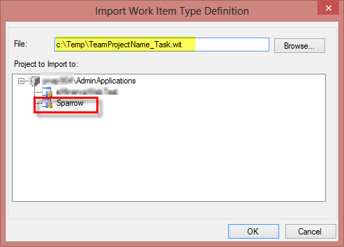</a> 
Figure: Browse to the location of the saved file, select the Team Project you wish to import the WIT into and click OK. 
<a href="./images/clip_image0131.png">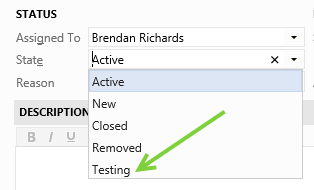</a> 
Figure: When you edit a task, the Testing status is now available. It is not yet however added to the board. <h3>Step 6: Export the Process Template Config</h3> 
This is the part that I always forget to do. After you have edited the Work Item Type, you still need to update the process template to include the State on the Task Board. 
<a href="./images/clip_image0141.png">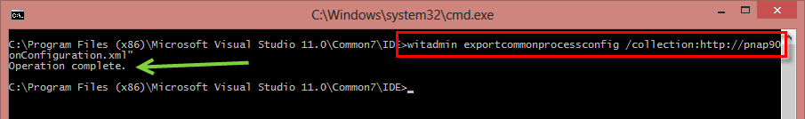</a> 
Figure: Open a command prompt, change to the Visual Studio IDE Folder and execute the following command 
witadmin exportcommonprocessconfig /collection:CollectionURL /p:ProjectName /f:"DirectoryPath\CommonConfiguration.xml" for our instance the command required was  witadmin exportcommonprocessconfig /collection:http://ourserver:8080/tfs/CollectionName /p:ProjectSparrow /f:"c:\Temp\CommonConfiguration.xml" <h3>Step 7: Edit the Process Template Config</h3> 
<a href="./images/clip_image0151.png">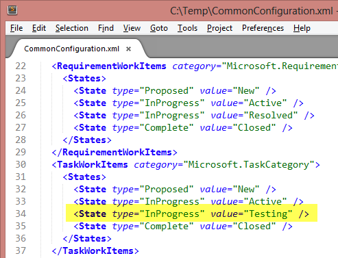</a> 
Figure: Edit the exported file. Find the section for TaskWorkItems and add the line highlighted above. <State type=”InProgress” value=”Testing” /> Save the file. <h3>Step 8: Import the Process Template Config</h3> 
<a href="./images/clip_image0161.png">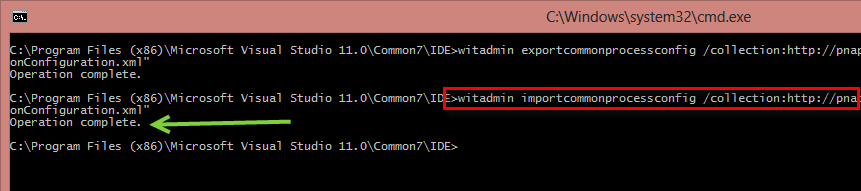</a> 
Figure: Execute the following command 
witadmin importcommonprocessconfig /collection:CollectionURL /p:ProjectName /f:"DirectoryPath\CommonConfiguration.xml" for our instance the command required was  witadmin importcommonprocessconfig /collection:http://ourserver:8080/tfs/CollectionName /p:ProjectSparrow /f:"c:\Temp\CommonConfiguration.xml" 
  

 
Figure: View your task board and you will have your new column!
