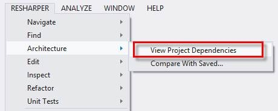
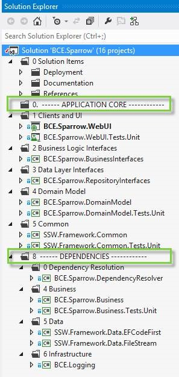
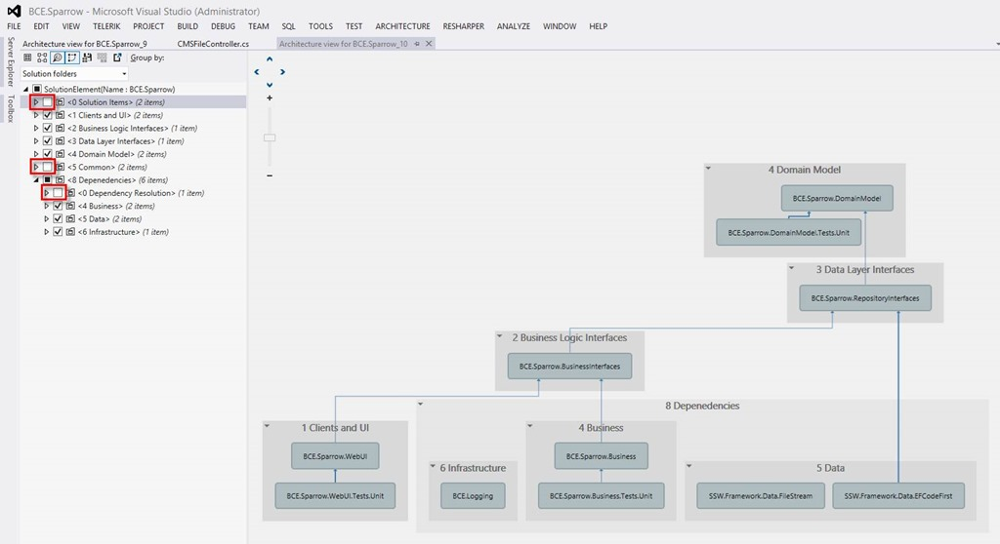
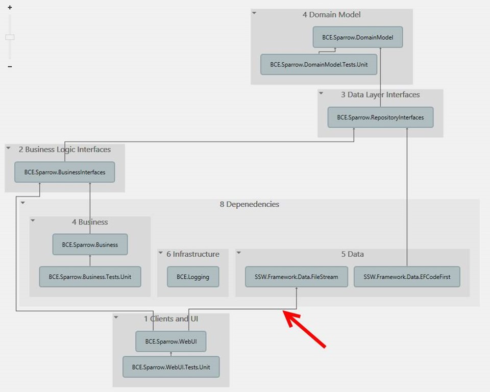
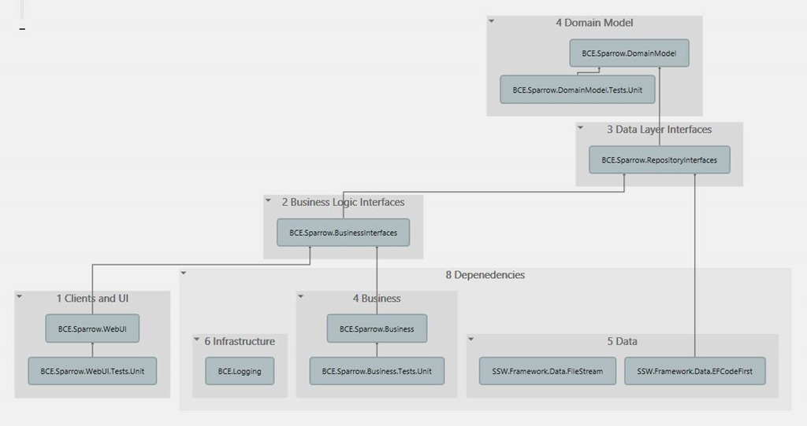
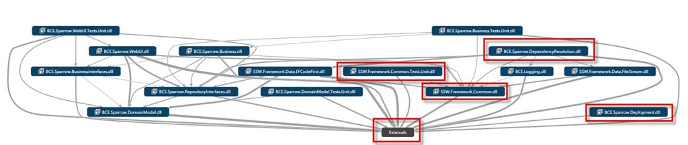
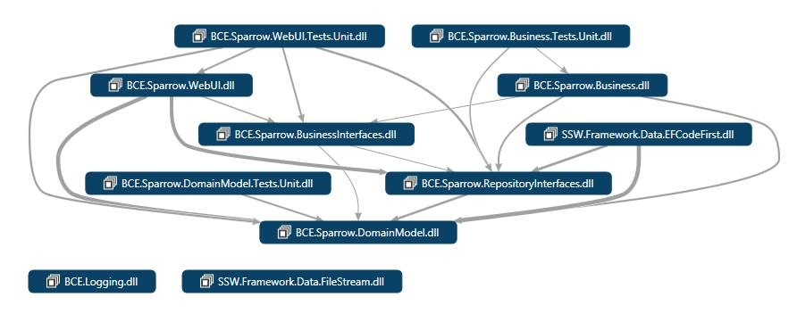
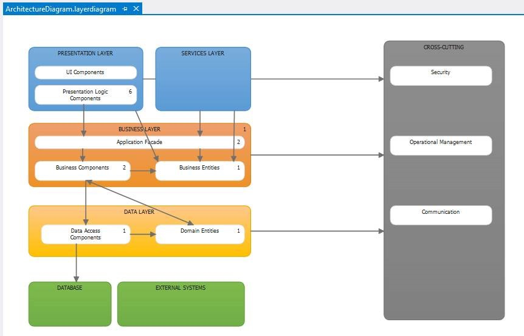

If you are a ReSharper user (and you should be), check out the new dependency graph. It is awesome for easily getting a high level view of the dependencies between projects and layers in your solution.  
 
Figure: ReSharper 8 introduces a dependency graph to its architecture tools. 
  
  
 
Figure: I structure my solution to reflect the Onion Architecture. <a href="http://rules.ssw.com.au/SoftwareDevelopment/RulesToBetterMVC/Pages/The-layers-of-the-onion-architecture.aspx">http://rules.ssw.com.au/SoftwareDevelopment/RulesToBetterMVC/Pages/The-layers-of-the-onion-architecture.aspx</a> 
I have layers for UI, Business Logic Interfaces, Repository Interfaces and the Domain Model. I then inject my dependencies into these layers. I like to structure the dependencies under a different solution folder so as to emphasise that the dependencies exist outside of the application core. 
  
  
 
Figure: R# now generates a dependency graph of your solution (or a selected part of your solution) and by default groups the projects by Solution folders.  
I love this because with a few clicks I can get a very clear idea of the dependencies between the different layers in my solution, and see where references exist to dependency projects.  
I unselected three items to remove noise from the diagram: the Solution Items folder (which contains the deployment project and documentation), the Common folder (which contains cross-cutting concerns) and the Dependency Resolver project which configures the IOC container. 
  
  
 
Figure: I generated the ReSharper dependency diagram as preparation for the first Sprint Review meeting and immediately noticed a dependency from my Client (UI) layer to a ‘Dependency’ project.  
No No No No No !!!  
  
  
 
Figure: We refactored to inject the dependency into the application core and removed the reference to Data.FileStream from the UI Project.  The dependency graph now looks awesome ! There are no lines from the Clients window to the Dependencies window! 
  
  
 
Figure: As a comparison, this is how the Visual Studio Dependency Graph looks when first created. I would usually then remove the outlined items to remove noise. 
  
  
 
Figure: After removing the extra projects, my Visual Studio Dependency Graph is more readable, but I would love to see the ability to group projects by Solution Folder. 
  
  
 
Figure: The Visual Studio architecture tools are more complete and advanced than the ReSharper ones at present and the Layer Diagram is an invaluable tool that allows you to specify all the layers of your solution, assign projects and classes to particular layers and then have the architecture validated when you build.  
  
What I love about the ReSharper dependency graph is how easy it makes it to get a high level overview of my solution.  
It also has the ability to track changes to your architecture as your project progresses, and to indicate metrics. I’ll let you know how these features work out for me as the project progresses.