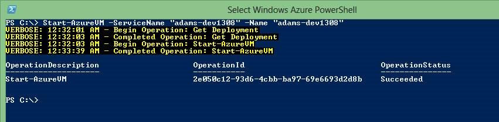

If you are working with Azure, you need to check out the Azure PowerShell Cmdlets. 
powerful + simple = AWESOME ! 
Here are a few very simple samples that I use to manage my Azure VMs. (There are Cmdlets to cover all of the Azure features and I’ll cover managing Cloud Services in a separate post.) 
 
Figure: “Get-AzureVM“. It lets you easily see what VMs you currently have provisioned (i.e. Are being charged for). 
<strong></strong>  
 
Figure: The Stop command let’s you de-provision a VM so you aren’t charged for it while you aren’t using it. I schedule this to run on each of my dev VMs.         No more $200 Azure bills for me because I forgot to shut down my large instance ! 
  
 
Figure: Of course you can start your VMs as well. 
 
 
 
In case you weren’t sold… here is a list of a few of my other favourites. 
 <table cellspacing="0" cellpadding="0" border="0"> <tbody> <tr> <td width="291"> 
Add-AzureWebRole
</td> <td width="283"> 
Restart-AzureVM
</td></tr> <tr> <td width="291"> 
Add-AzureWorkerRole
</td> <td width="283"> 
Restart-AzureWebsite
</td></tr> <tr> <td width="291"> 
Get-AzureRole <b>(List your roles)</b>
</td> <td width="283"> 
Set-AzureDeployment
</td></tr> <tr> <td width="291"> 
Get-AzureService <strong>(List cloud services)</strong>
</td> <td width="283"> 
Set-AzureRole <strong>(Sets the # of instances)</strong>
</td></tr> <tr> <td width="291"> 
Get-AzureStorageBlob
</td> <td width="283"> 
Set-AzureService
</td></tr> <tr> <td width="291"> 
Get-AzureVM <strong>(Get VM info)</strong>
</td> <td width="283"> 
Show-AzurePortal
</td></tr> <tr> <td width="291"> 
Get-AzureWebsite
</td> <td width="283"> 
Show-AzureWebsite
</td></tr> <tr> <td width="291"> 
Get-AzureWebsiteDeployment
</td> <td width="283"> 
Start-AzureVM
</td></tr> <tr> <td width="291"> 
Get-AzureWebsiteLocation
</td> <td width="283"> 
Start-AzureWebsite
</td></tr> <tr> <td width="291"> 
Move-AzureDeployment <strong>(staging->prod!)</strong>
</td> <td width="283"> 
Stop-AzureVM
</td></tr> <tr> <td width="291"> 
New-AzureVM
</td> <td width="283"> 
Stop-AzureWebsite
</td></tr> <tr> <td width="291"> 
New-AzureWebsite
</td> <td width="283"> </td></tr></tbody></table> 
  
 
<b>For more info</b>:  
Check out MSDN <a href="http://msdn.microsoft.com/en-us/library/jj156055.aspx">http://msdn.microsoft.com/en-us/library/jj156055.aspx</a>
