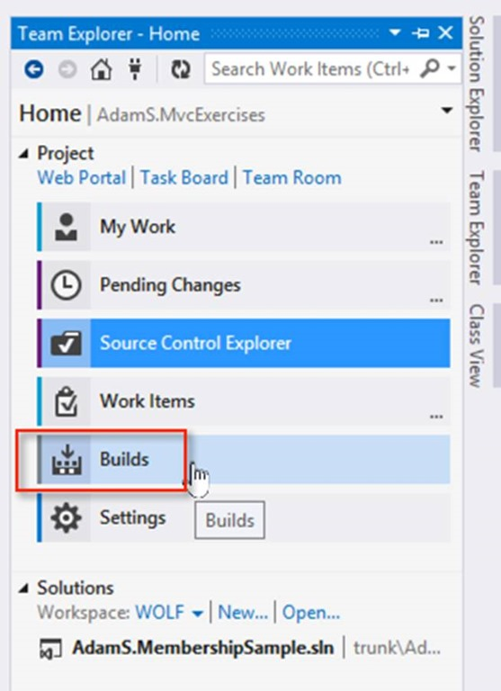
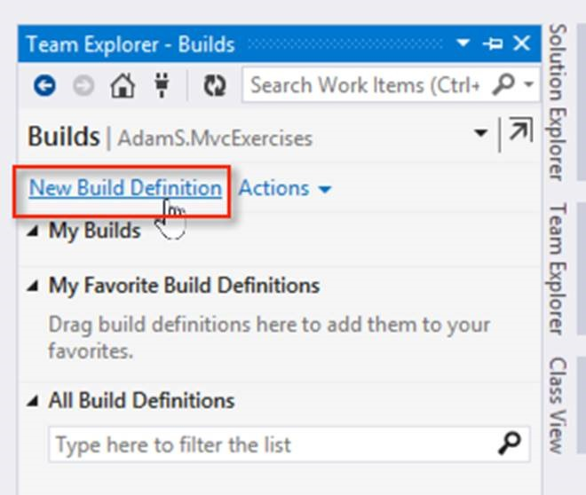
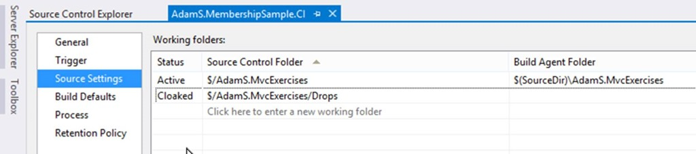
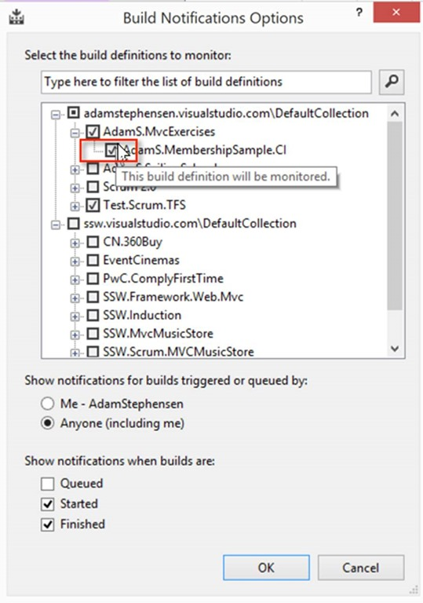
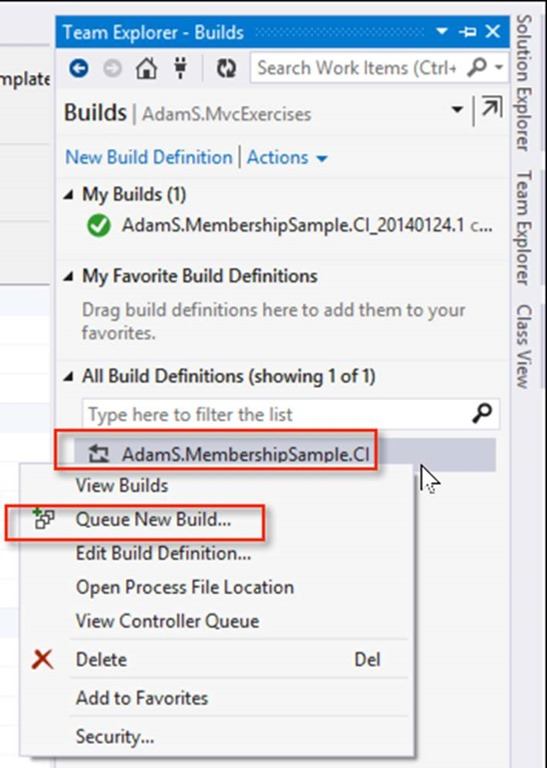
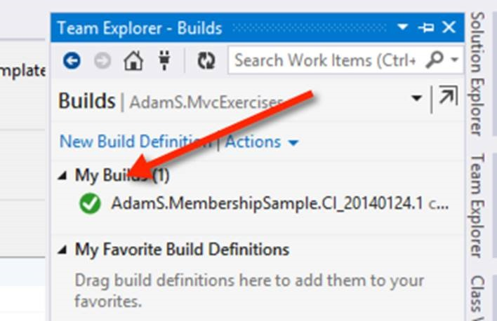

<h1>Configure Your Build</h1> 
1. Open the Build Pane 
 
Figure: From Team Explorer choose Builds 
  
2. Create a new build definition 
 
Figure: Click on the <b>New Build Definition</b> link 
  
3. Enter build definition name “AdamS.MembershipSample.CI” (CI for Continuous Integration)
 
 4. On the Trigger tab choose ‘Continuous Integration’
 
 
 
5. On the Source Settings tab remove any unwanted Source Control folders  
Figure: Remove any items that do not apply to your project (sometimes items from other solutions will appear in this list – remove them) 
  
6. On the Process tab, ensure that the solution is being built 
  
7. Save the Build <h5> </h5> <h1>Configure Build Notifications</h1> 
1. Run the Visual Studio Build Notification application. 
From C:\Program Files (x86)\Microsoft Visual Studio 12.0\Common7\IDE\BuildNotificationApp.exe 
  
2. Select the build 
 
Figure: Select the Build that you just created and click OK <h5> </h5> <h1>Start a Build</h1> 
  Figure: Go to Team Explorer | Builds. Right click on the Build and choose Queue New Build 
  
 
Figure: When the build is complete, you will get a green or red icon indicating the status.