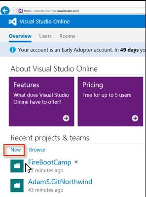
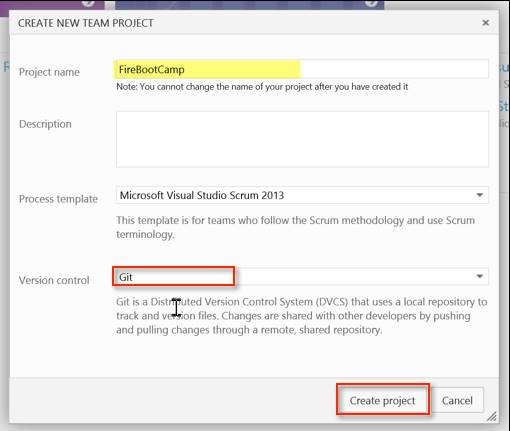
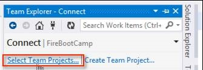
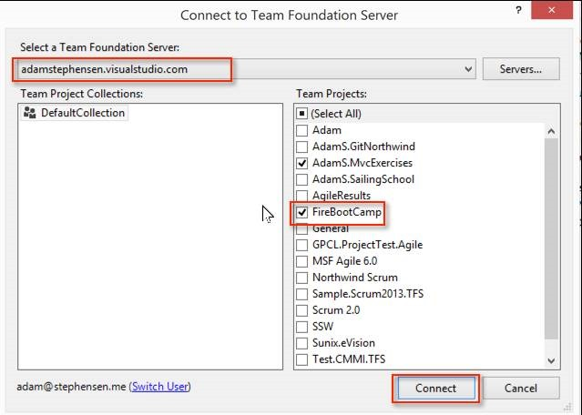
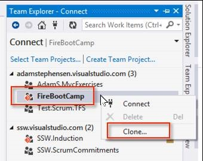
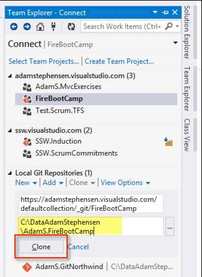
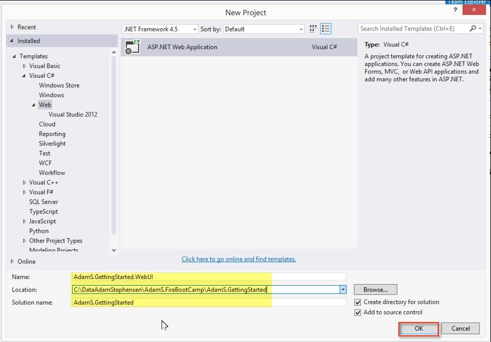
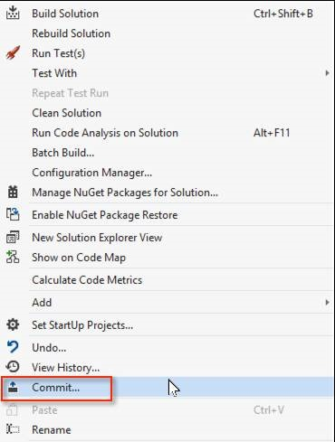
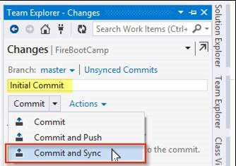

I got asked for a 60 second intro to using TFS-Git. <h3>1. Go to your personal TFS (e.g. adamstephensen.visualstudio.com)</h3> 
  <h3>2. Create a new Team Project   </h3> 
Figure: Click on New under Recent projects  & teams
 
  Figure: Enter the name of the Team Project (E.g. FireBootCamp) Select <b>Git</b> as the version control system. Select <b>Create project</b>
 
<strong></strong> 
 <h3>3. Clone your Repository locally</h3> 
  Figure: In Visual Studio, open <b>Team Explorer </b>and click <b>Select Team Projects</b> 
  Figure: Select the team foundation server to connect to, select the team project and then click <b>Connect </b> 
  Figure: Right click on the Repository and select <b>Clone</b> 
  Figure: Enter the path to the local repository and click the <b>Clone </b>button 
  <h3>4. Add your MVC project to the Repo</h3> 
  Figure: Create the MVC Project 
  Figure: Right click on the Solution file and click Commit 
  Figure: Enter a comment and click <b>Commit and Sync</b>