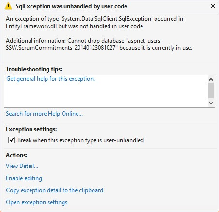

When working with the Entity Framework Code First I will often get the error below: 
 <blockquote> 
An exception of type “System.Data.SqlClient.SqlException’ occurred in EntityFramework.dll but was not handled by in user code’
 
Additional information: Cannot drop database [database name] because it is currently in use.
</blockquote> 
To force a delete of the database, follow the steps below. 
 

 
Figure: This exception is common after you have opened a LocalDb database in Visual Studio.
 

 
 

<h2>Open Library Package Manager and Stop the LocalDb instance</h2> 

a: Select Tools | Library Package manager | Package Manager Console 
 

b: Execute the following two statements 
 
                  sqllocaldb stop v11.0 
 
                  sqllocaldb delete v11.0 

 
 

Figure: The steps above will stop and delete the LocalDb instance.
 
 
 

<h2>Delete the database file from the database</h2> 

 
Figure: Open the Solution Explorer and choose Show All Files
 

 
Figure: Delete the mdf from the App_Data folder
