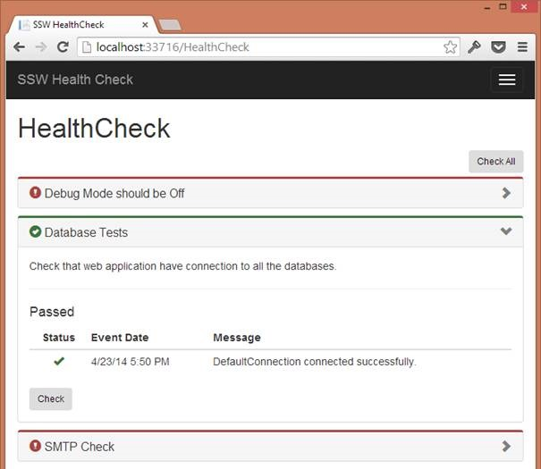
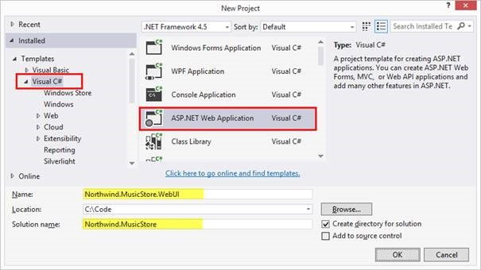
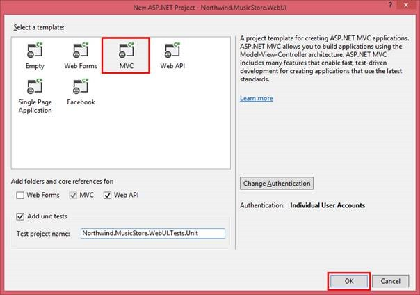
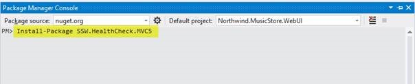
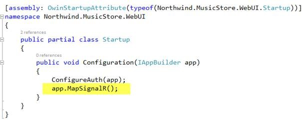
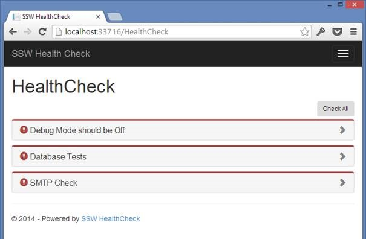
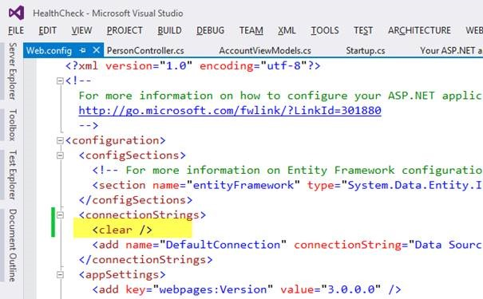
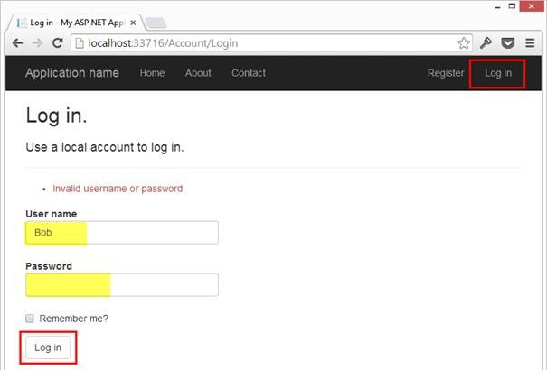

<h1>We ALWAYS automate our deployments. We always deploy often.  </h1> 
This has many, many benefits. The most important of which is early feedback.
 
An essential tool when managing deployment of many sites to different environments is a smoke-test page that validates the configuration of the website in that particular environment. 
 
SSW.HealthCheck makes it easy to check your site status.
 
 
 

 
Figure: SSW.HealthCheck let’s us see at a Glance that on this site: the database connection is valid, but Debug mode has not been turned off and SMTP is not configured. We can also easily extend SSW.HealthCheck to perform other tasks like ensuring your database is up to date. I’ll address this in a future article.
 
 
 <h1>Create a new web project</h1> 
Lets start with a new web project, then we’ll add SSW.HealthCheck.
 
 
Figure: Create a new web project called Northwind.MusicStore.WebUI 
  
 
Figure: Select the MVC template and click OK. Optionally: add the ‘Web.API’ and ‘Add unit tests’ options. <h5>Add SSW.HealthCheck.MVC5 to WebUI</h5> 
 
Figure: Select Tools | Library Package Manager | Package Manager Console. Enter <b>Install-Package SSW.HealthCheck.MVC5</b> and press Enter. 
Note: Alternatively you can use Tools | Library Package Manager | Manage NuGet Packages for the Solution, and then search for SSW.HealthCheck.MVC5 and click Install. 
 Figure: Ensure SignalR is configured: Open Startup.cs from the root of your application. Ensure app.MapSignalR() is being called in the Configuration method. 
 
Figure: Run the application and navigate to /HealthCheck <h5>Configure HealthCheck to Test Your Connection Strings</h5> 
 
 Figure: Because we are using Entity Framework Code First, and it does not actually create the database until the first time it is accessed: Click the <b>Log In</b> link from the toolbar, enter any username and password and click <b>Log In</b>. Because we are trying to access the database to verify credentials this will cause the database to be created. 
 
Figure: The HealthCheck status of your DefaultConnection should now be <b>Passed !</b> 
Also, check out the SSW.HealthCheck user guide here <a href="http://sswhealthcheck.com/user-guide/">http://sswhealthcheck.com/user-guide/</a>
