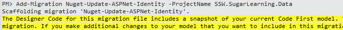

ASP.NET.Identity 2.0 is out, and it adds a bunch of great features.
 
- Two-Factor Authentication (SMS, Email or custom) - Account Lockout - Account Confirmation via Email - Password Reset - Sign out everywhere - Choose your Primary Key type (string, int, Guid) - IQuerable Users and Roles  - Delete User - Enforcing Unique User Names
 
 
 
The upgrade was more fiddly than I thought it would be. Here is what I had to do. I hope it helps.
 
 
 
1. Update Entity Framework to 6.1
 
2: Update all your OWIN components if they already exist in your project. 
 
(Yes. NuGet should handle this for me. It didn’t. Upgrading the Owin components before the Identity packages resolved some issues for me)
 

 
 
 
3: Update Microsoft ASP.Net Identity Core and then ASP.Net Identity EntityFramework
 

 
 
 
4: Your model has now been updated to v2.0 !
 
If you are running Code First Migrations you now need to create a migration to reflect the changes to the database.
 

 
Figure: When you try to create the migration, it will tell you that the model backing the db context has changed. To resolve it, you need to update the constructor of your dbcontext.
 
 
 

 
Figure: Adding ‘, throwIfV1Schema:false’ as a parameter to the constructor will allow you to run the application, and create the required Code First Migration.
 
 
 

 
Figure: After updating the db context constructor, Add-Migration works as expected.
 
 
 

 
Figure: You can now inspect the changes to the schema in the Migration.
 <h2>Upgraded !</h2> 
Now check out the links below to get help on how to implement the great new features in ASP.Net Identity 2.0.
 
 
 <h3>Resources: </h3> 
ASP.NET MVC and Identity 2.0: Understanding the Basics
 
<a title="http://typecastexception.com/post/2014/04/20/ASPNET-MVC-and-Identity-20-Understanding-the-Basics.aspx" href="http://typecastexception.com/post/2014/04/20/ASPNET-MVC-and-Identity-20-Understanding-the-Basics.aspx">http://typecastexception.com/post/2014/04/20/ASPNET-MVC-and-Identity-20-Understanding-the-Basics.aspx</a>
 
- a great overview of Identity 2.0
 
 
 
Announcing RTM of ASP.NET Identity 2.0.0
 
<a title="http://blogs.msdn.com/b/webdev/archive/2014/03/20/test-announcing-rtm-of-asp-net-identity-2-0-0.aspx" href="http://blogs.msdn.com/b/webdev/archive/2014/03/20/test-announcing-rtm-of-asp-net-identity-2-0-0.aspx">http://blogs.msdn.com/b/webdev/archive/2014/03/20/test-announcing-rtm-of-asp-net-identity-2-0-0.aspx</a>
 
- definitely worth reading !
 
- contains list of features and some upgrade notes

