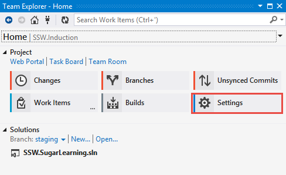
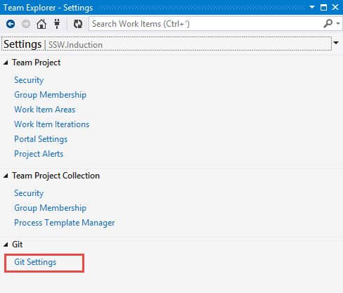
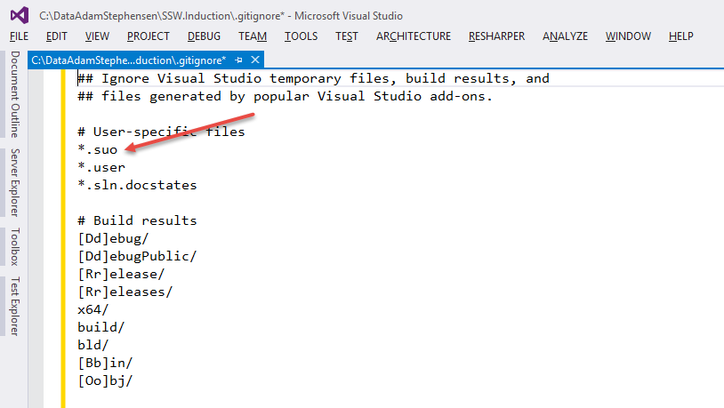
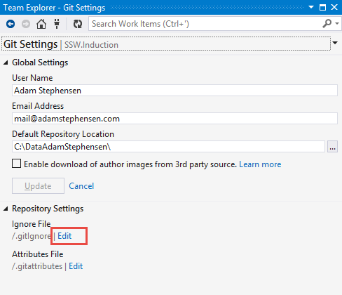
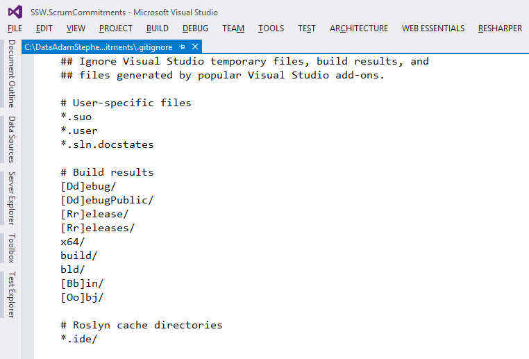
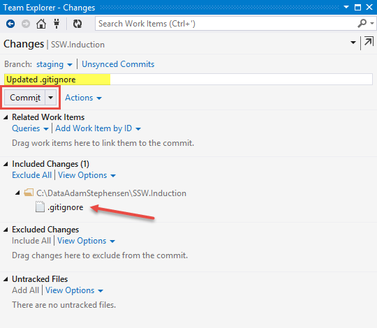
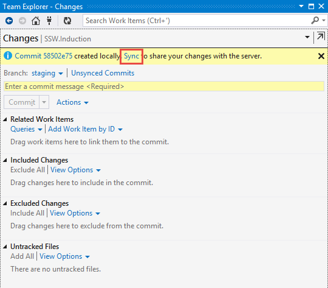
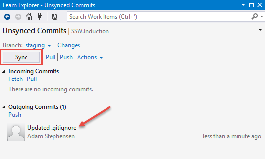

One of the most common issues I am finding with teams moving from Team Foundation Version Control to TFS-Git is that they are including files in their repositories that they shouldn’t. The most common offenders are .suo user settings files, Nuget packages and Azure publish settings.   Luckily, the solution is straightforward.   
 
1. Ensure you have no pending changes. 
 
2. Close the solution 
 
3. Go into Team Explorer and click Settings    
 
 
 
4. In the Settings tab select Git Settings    
 
 
 
5. Open the .gitignore file from GitHub that is specific to Visual Studio projects and copy the contents to the clip board. <a title="https://raw.githubusercontent.com/github/gitignore/master/VisualStudio.gitignore" href="https://raw.githubusercontent.com/github/gitignore/master/VisualStudio.gitignore">https://raw.githubusercontent.com/github/gitignore/master/VisualStudio.gitignore</a>   Figure: the .gitignore includes a list of all of the files that you want to avoid committing to your repository  
 
 
 
 4. In Settings | Repository Settings, click the Edit link next to ‘/,gitIgnore’    
 
 
 
 
 
6. Paste the contents of the .gitIngore from GitHub into the .gitignore file and Save it.    
 
 
 
7, In Team Explorer, navigate to the Changes window. Enter a comment and click Commit.    
 
 
 
8. Click the Sync link to take you to Unsynched Commits    
 
 
 
9. Click the Sync button to push your updated .gitIgnore    
 
 
 
10. If you have included files in your repository that you wish to exclude from the repository but not delete from your local working directory refer to 
 
<a href="http://adamstephensen.com/git-essentials#Remove-files-from-your-repository" target="_blank">Remove files from your repository (so that they aren't tracked), but leave them in the working directory</a> 
 
on my page for 
 
<a href="http://adamstephensen.com/git-essentials/" target="_blank">Git: Essential Commands for Visual Studio Developers</a>

