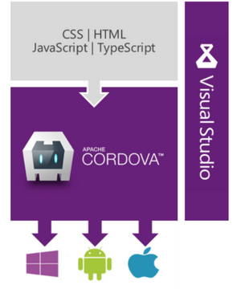
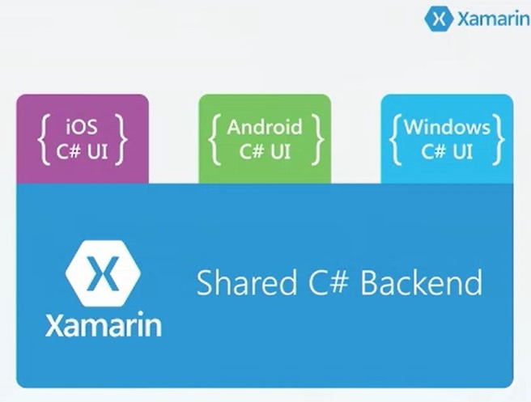
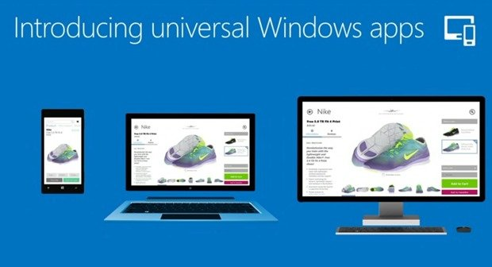

I seriously love my Windows Phone... except for the availability of apps.

Making Visual Studio the best environment for multi-platform development will be key to the success of Windows Phone. If developers that need to build IOS and Android apps move to Visual Studio from the native options in order to get cross-platform compatibility, they are far more likely to ship Windows Phone apps as well.

Here is a very brief overview of the options for creating cross-platform applications in Visual Studio. If you aren’t across these options already, you should get reading. This is way forward!

Stay tunes, I’ll be writing a lot more about each of these options.
<h2>Option 1: Cordova for building web based cross platform applications</h2>

Build apps for iOS, Android & Windows Phone using HTML and JavaScript

Great Because: It’s Html and JavaScript

Watch Out: It takes effort and know-how to make these apps slick on underpowered, occasionally connected devices.

 

 

 

 

Further Reading:

<a href="http://techcrunch.com/2014/05/12/microsofts-visual-studio-adds-support-for-building-cross-platform-hybrid-apps-with-apache-cordova" target="_blank">Microsoft’s Visual Studio Adds Support For Building Cross-Platform Hybrid Apps With Apache Cordova</a>

<a href="http://thenextweb.com/microsoft/2014/05/12/microsoft-releases-visual-studio-2013-update-2-support-apache-cordova-asp-net-vnext-preview/" target="_blank">Microsoft releases Visual Studio 2013 Update 2, support for Apache Cordova, ASP.NET vNext preview, and more</a>

 
<h2>Option 2: Xamarin for building native cross platform applications</h2>

Build apps for iOS, Android & Windows Phone by writing all your common code in C#, and then building separate native User Interfaces for each platform.

Great Because: You get the full native experience on each platform

Watch Out: You need to build a separate UI for each platform

Further Reading:

<a title="http://stuff.seans.com/2014/05/15/teched-na-2014-native-mobile-application-development-using-xamarin/" href="http://stuff.seans.com/2014/05/15/teched-na-2014-native-mobile-application-development-using-xamarin/" target="_blank">TechEd NA 2014 – Native Mobile Application Development using Xamarin</a>

<a href="http://www.zdnet.com/microsoft-and-xamarin-tighten-mobile-app-development-ties-7000023143/" target="_blank">Microsoft and Xamarin tighten mobile app-development ties</a>

 
<h2>Option 3: Universal Windows Apps</h2>

Build apps that will run on Windows Phone, Windows 8 & XBox.

Great Because: The Windows platforms are converging. This is great news for Windows Phone.

Watch Out: You don’t get IOS or Android support.

Further Reading:

<a title="http://thenextweb.com/microsoft/2014/04/02/microsoft-build-2014/" href="http://thenextweb.com/microsoft/2014/04/02/microsoft-build-2014/" target="_blank">Microsoft announces universal Windows apps, which work across PCs, phones, tablets, and Xbox One</a>

