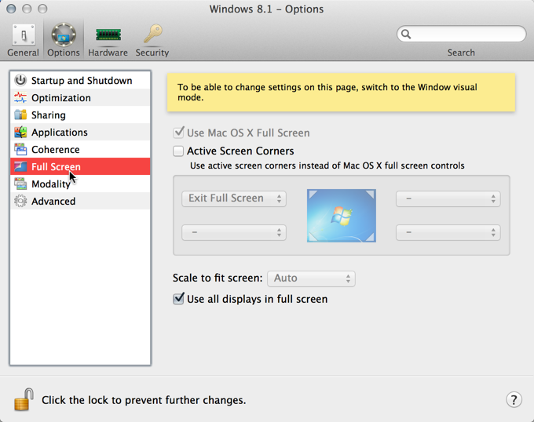

I L.O.V.E. developing on my 15” MacBook Pro, but I had some fiddling to get it just right.

Here is a quick post about how I have it configured.

Overview
- Software: Parallels for Mac (I intend to check out VMware Fusion when I get some time.)
- I don't use a BootCamp partition.
If you run Parallels from a BootCamp partiton you lose the ability to take snapshots, which I love.
In the future, when working more with mobile emulators, I might find that I need to boot natively into Windows and change to working from a BootCamp partition.

Figure: I allocate 8 of my 16Gb of RAM and 4 of my 8 'virtual' CPUs because Visual Studio is still awesomely fast, and I often use the spare Ram and CPUs for other VMs (e.g. for testing older browsers)

Figure: I have performance optimised for the VM

Figure: My sharing settings.
The 'Shared Profile' setting determines if you integrate Windows into OSX. I don't enjoy this experience at all.
Tip: Install DropBox on OSX, not in Windows and then tick ‘Shared Cloud’

Figure: I prefer not to share my Windows application with Mac. I don’t use Coherence. I run my VM full screen and when I’m in my Visual Studio VM I don’t want to be distracted.

Figure: I turn off the Active Screen Corners. I find them annoying and prefer shortcut keys.

Figure: I sync my Windows time from OSX

Figure: I turned off all the Mission Control shortcuts, as they interfere with my Visual Studio shortcuts.

Figure: I have turned off most of the default OSX keyboard shortcuts, but find Ctrl + F2 (Focus the OSX Menu Bar) and Ctrl + F3 handy (Focus the OSX Dock)

As always, I love feedback and suggestions.

