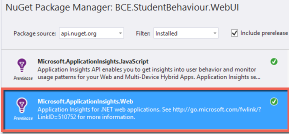

While everyone is making the move to MVC 6 (and it is pretty awesome), not everything is there yet.

Until it works out of the box, here is an easy way to wire up your MVC 6 project to log all exceptions to Application Insights.
<h2>Create the Application Insights resource via the Azure Portal</h2>
1. Sign in to the <a title="" href="http://portal.azure.com/">Azure portal</a>, and create a new Application Insights resource. Choose ASP.NET as the application type.

A <a title="" href="http://azure.microsoft.com/en-us/documentation/articles/app-insights-resources-roles-access-control/">resource</a> in Azure is an instance of a service. This resource is where telemetry from your app will be analyzed and presented to you.

The choice of application type sets the default content of the resource blades and the properties visible in <a title="" href="http://azure.microsoft.com/en-us/documentation/articles/app-insights-metrics-explorer/">Metrics Explorer</a>.
<h4>2. Take a copy of the Instrumentation Key.</h4>
The key identifies the resource, and you'll install it soon in the SDK to direct data to the resource.

<h2>Create the Exception Filter to log all exceptions</h2>

Figure: Add the ApplicationInsights.Web NuGet package

Figure: Create the Telemetry class to instantiate an instance of the TelemetryClient with your InstrumentationKey & the AiHandleErrorAttribute class that will log exceptions to Application Insights.

Figure: Wire up the ExceptionFilterAttribute in Startup.cs

