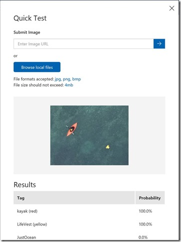

It's a great time to be a technologist. I am spending lots of my time at the moment thinking drones, AI & IOT, and about where these technologies intersect, and where they can help people.

I was very happy when I got asked today to do a quick 10 minute presentation on 'Where are we at with drones'.

Rather than just deliver it once I thought I'd capture some thoughts here.

## eSmart Systems - Using drones for power line inspection

Maintenance of electrical grids is not only time consuming and costly, but it can also be very dangerous. By developing a connected drone that uses AI and cognitive services from Microsoft Azure, utility companies can reduce blackouts and inspect power lines more safely. 



## Microsoft FarmBeats -Uses drones, AI and IOT Edge to increase farm productivity

Microsoft FarmBeats aims to enable farmers to increase farm productivity and reduce costs by enabling data-driven farming.

> A new partnership between Microsoft and leading drone maker DJI builds on the work both companies are doing with data and agriculture that could make it easier and more affordable for farmers to quickly get the information they need to make crucial decisions about soil moisture and temperature, pesticides and fertilizer. Hours and days spent walking or driving the fields to try to detect problems can be eliminated.
> Since 2011, farmer Sean Stratman has grown kale, cauliflower, broccoli and squash in Carnation, Washington. Then, a few years ago, he added a new crop to his bounty: knowledge, using drones and the intelligent edge to get near-real-time information about issues like soil moisture and pests. It’s the kind of information that is not only helping him, but could benefit farmers around the world.

> (Source: https://news.microsoft.com/transform/farmings-most-important-crop-may-be-the-knowledge-harvested-by-drones-and-the-intelligent-edge/ )



More reading on FarmBeats
- https://www.microsoft.com/en-us/research/project/farmbeats-iot-agriculture/

## Project Premonition - Using drones to fight infectious diseases

Emerging infectious diseases such as Zika, Ebola, Chikungunya and MERS are dangerous and unpredictable. Public health organizations need data as early as possible to predict disease spread and plan responses. Yet early data is very difficult to obtain, because it must be proactively collected from potential disease sources in the environment. Researchers estimate between 60 and 75% of emerging infectious diseases originate from animals, which are very difficult to monitor.

Project Premonition aims to detect pathogens before they cause outbreaks — by turning mosquitoes into devices that collect data from animals in the environment. 

It does this by
- Finding mosquito hotspots by drone
- Collecting mosquitos with robots
- Detecting pathogens by gene sequencing



Full Article: https://www.microsoft.com/en-us/research/project/project-premonition/
More Info: https://www.microsoft.com/en-us/research/video/project-premonition-seeking-to-prevent-disease-outbreaks-extended/

## Teaching Drones to Aid Search and Rescue efforts via Cognitive Services

InDro Robotics, a drone operating outfit based in Salt Spring Island British Columbia, recently connected with our team at Microsoft to explore how they could better enable their drones for search and rescue efforts.

Leveraging Custom Vision Cognitive Service and other Azure services, including IoT Hub, InDro Robotics developers can now successfully equip their drones to:

- Identify objects in large bodies of water, such as life vests, boats, etc. as well as determine the severity of the findings
- Recognize emergency situations and notify control stations immediately, before assigning to a rescue squad
- Establish communication between boats, rescue squads and the control stations. The infrastructure supports permanent storage and per-device authentication

Full article: https://blogs.technet.microsoft.com/canitpro/2017/05/10/teaching-drones-to-aid-search-and-rescue-efforts-via-cognitive-services/

## More info

If you are interested in other use cases or info on drones I keep a scratch pad on drone tech in my [FAQs collection on drones](https://github.com/adamstephensen/faqs/tree/master/drones).

If you are doing something awesome with Drones, AI and Azure please reach out. I would love to chat !
