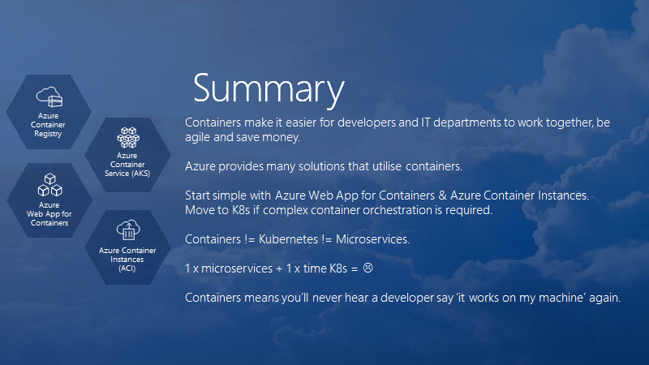

I have put a new slide deck together as an overview of containers.

<a title="View Containers - The secret to shipping cloud workloads on Scribd" href="https://www.scribd.com/presentation/405762156/Containers-The-secret-to-shipping-cloud-workloads#from_embed"  style="text-decoration: underline;">Containers - The secret to shipping cloud workloads</a> by  on Scribd
<iframe class="scribd_iframe_embed" title="Containers - The secret to shipping cloud workloads" src="https://www.scribd.com/embeds/405762156/content?start_page=1&view_mode=scroll&show_recommendations=true&access_key=key-0HQYEksHZNhpmDhLBn61" data-auto-height="true" data-aspect-ratio="null" scrolling="no" width="100%" height="600" frameborder="0"></iframe>